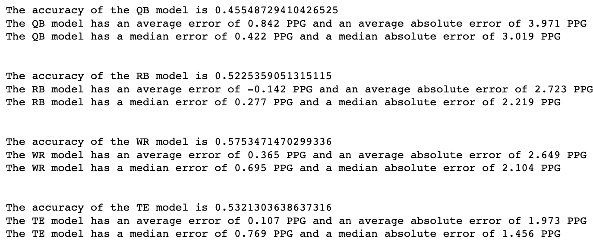
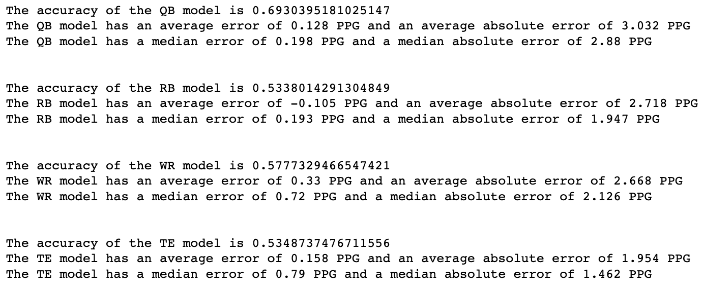
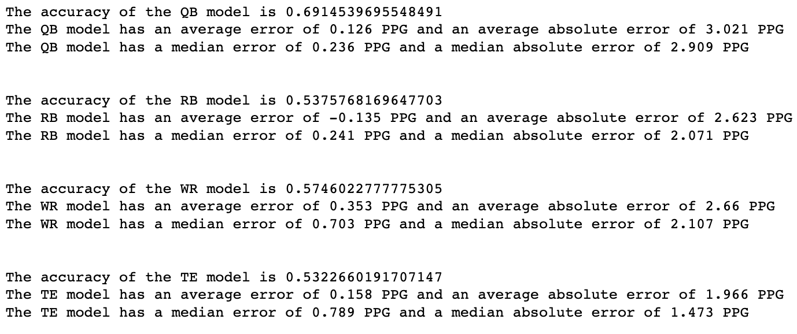
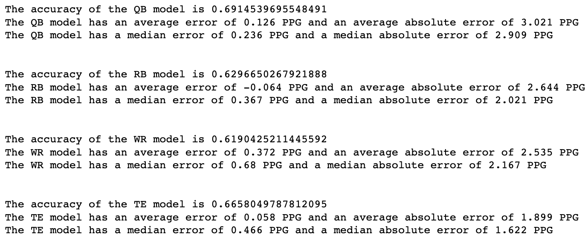
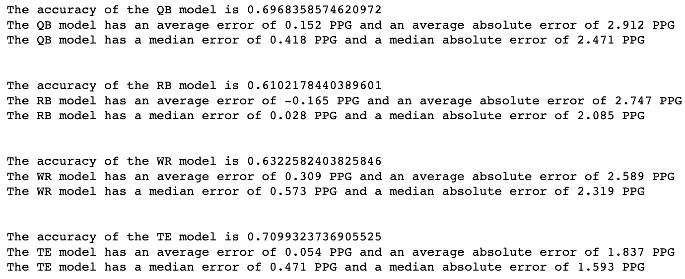
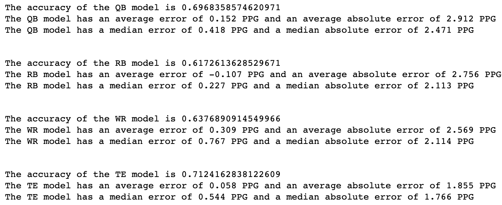

# Fantasy Football Foresight
## Overview
### Selected Topic
Predicting 2022 Fantasy Football Outcomes

### Reasoning
All five members of our team are sports fans and we were deciding between predicting what cities would most likely receive a professional sports team in a hypothetical relocation and predicting future sports outcomes at a player level. Upon further review, we felt that predicting future performances at the player level had more ample data to train a model with and we could achieve more reliable data insights. Naturally, given the popularity of fantasy football we felt predicting 2022 NFL player outcomes would be both a fun and fulfilling project to jump into. Additionally, with the rise of mobile sports betting, we felt being able to create a model to accurately predict fantasy football outcomes could also be helpful in the sports betting decision making process.

### Source Data
All of our data is provided through web scapes of Pro-Football-Reference, a website where statistics are presented in tabular form and have an easy to access API. We included both basic and advanced statistics at the indivdual leve, as well as basic statistics at a team level.

### Questions
- What variables carry the most weight in predicting a player's fantasy football performance?
- Can a future season be predicted using a previous seasons statistics?
- What will the final fantasy football rankings be for the 2022 season?

### Tools Used
- We used Python, Pandas, Splinter, BeautfiulSoup, and ChromeDriver to scrap our data and prepare our datasets
- We used pgAdmin, Postgres, and the SQL language to create tables to be fed our datasets, and in turn, feed into an AWS database
- We used SKLearn and SQLAlchemy to create our models and feed in the data from our database directly into our model
- We used R Studio to create visualizations and explore relationships in the data
- We used Tableau for our dashboard and storytelling with other visualizations

## Outline of Repository
### Database Folder
Includes working code that scrapes the Pro-Football-Reference website, cleans the returned data in a functional pandas DataFrame, and creates a CSV file to be loaded into pgAdmin. 
### Database_CSVs Folder
Includes all data, in CSV format, that is currently in our AWS Database.
### Models Folder
Includes our five attempts at using different variables to increase the accuracy of our model, as well as our final model with the metrics we feel carry the most weight in predicting future fantasy football outcomes.
### Prediction_CSVs
Inclues our 2021 predictions to be used in visualizations showing the difference between predicted outcomes and actual fantasy points per game
### Testing
Our catch-all folder that includes our many trial and error attempts at creating functions to scrape for our data and cleaning up code to be succinct and efficient.

## Data Exploration and Database Creation
In fantasy football, competitors select, or "draft", imaginary teams of real-life NFL players and "score" points according to the performance of each player on a weekly basis. These points are then aggregated for an overall team score in a head-to-head setting against another imaginary team of real-life players. The team with the highest score wins!

The default scoring rules (including point-per-reception, which would be a part of a "PPR League") relies on the following stats:
- Passing:
    - Passing Yards - 0.04 points per yard (25 yards = 1 point)
    - Passing Touchdowns - 4 points per touchdown
    - Interceptions - (-2) points per interception
- Rushing:
    - Rushing Yards - 0.1 points per yard (10 yards = 1 point)
    - Rushing Touchdowns - 6 points per touchdown
    - Fumbles - (-2) points per fumble lost
- Receiving:
    - Receptions (Catches) - 1 point per catch
    - Receiving Yards - 0.1 points per yard (10 yards = 1 point)
    - Receiving Touchdowns - 6 points per touchdown
    - Fumbles - (-2) points per fumble lost

In our initial data exploration, we wanted to ensure the base stats that make up the scoring system would be included in our tables. From there, we thought of other available statistics that would gauge a player's abilities to "score" more points that weren't present in the actual scoring system (for example, did a receiver have a good or bad quarterback? What statistic could gauge if the reason they scored less points wasn't due to ability, but bad luck in who was throwing them the ball?). 

### Data Preprocessing
Once we found a large amount of what we deemed relavant variables, we created scraping functions that could be repeated on certain areas of the Pro-Football-Reference website using years as an input. During our initial preprocessing phase, we cleaned up the dataset to remove unnecessary characters, renamed our columns, dropped null values, and standardized certain columns on a per game basis, considering we wanted our targeted output to be "fantasy points per game".

### Feature Engineering
A couple of features we engineered in an effort to increase accuracy were target/rushing share and a binary "starter" and "next year starter" flag. We created the target and rushing shares metrics by dividing the target or rushing attempts columns by the team passing attempts and team rushing attempt columns, after joining the individual stats and team stats tables through a SQL query. 

Photo

We created the "starter" flag by first investigating the data to find a threshold to work with, ultimately deciding to designate a QB as a "starter" if they:
- Started over 76% of games they played in
- Started at least 5 games in the season

Finally, we used that same flag to create the "next_yr_starter" column to help filter out QBs that couldn't score high PPG in the following season due to not being a starter. 

### Data Decisions
We needed 4 separate models for the 4 different football positions given the difference in weight of certain statistics on certain positions. For example, passing and rushing stats were more heavily weighted for QBs and RBs, while targets and receptions were more heavily weighted for WRs and TEs. With this in mind, we created a robust dataset that could then be sliced before being put into our models so we could gear each model to a specific position. 

### Training and Testing Data
We decided to use a decade worth of statistics and we split our model to train on nine years of data (2012-2020) and test on two (2020-2021). We then predicted 2022 statistical outcomes based on the 2021 individaul statistics. 

### Model Choice
We decided on a Linear Regression model given the continuous data inputs and outputs we were expecting. The limitation of this is not being able to use a more robust model like a neural network, which could find a greater number of connections within the data. However, given the non binary nature of the outputs we were expecting (points per game), a linear regression model made more sense. We did not change our model choice through the course of the project.

## Analysis
### Model Attempts with Accuracy by Attempts
### 1st Attempt

 - QBs:
    - Attributes: Passing Attempts, Passing Yards, Passing Touchdowns, Rushing Attempts, Rushing Yards, Rushing Yards Per Attempt, Fantasy Points Per Game
    - Accuracy: 45%
    - Average Error: 0.8 PPG
    - Absolute Average Error: 4.0 PPG
    - Median Error: 0.4 PPG
    - Absolute Median Error: 3.0 PPG
 - RBs:
    - Attributes: Age, Rushing Attempts, Rushing Yards, Rushing Yards Per Attempt, Rushing Yards Per Attempt, Targets, Receptions, Reception Yards, Yards Per Reception, Fantasy Points Per Game
    - Accuracy: 52%
    - Average Error: -0.1 PPG
    - Absolute Average Error: 2.7 PPG
    - Median Error: 0.3 PPG
    - Absolute Median Error: 2.2 PPG
 - WRs:
    - Attributes: Age, Targets, Receptions, Reception Yards, Yards Per Reception, Fantasy Points Per Game
    - Accuracy: 58%
    - Average Error: 0.4 PPG
    - Absolute Average Error: 2.6 PPG
    - Median Error: 0.7 PPG
    - Absolute Median Error: 2.1 PPG
 - TEs:
    - Attributes: Age, Targets, Receptions, Reception Yards, Yards Per Reception, Fantasy Points Per Game
    - Accuracy: 53%
    - Average Error: 0.1 PPG
    - Absolute Average Error: 2.0 PPG
    - Median Error: 0.8 PPG
    - Absolute Median Error: 1.5 PPG

### 2nd Attempt

 - QBs:
    - Attributes Kept: Passing Attempts, Passing Yards, Passing Touchdowns, Rushing Attempts, Rushing Yards, Rushing Yards Per Attempt, Fantasy Points Per Game
    - Attributes Added: Starter designation, Next Year Starter designation
    - Accuracy: 69%
    - Average Error: 0.1 PPG
    - Absolute Average Error: 3.0 PPG
    - Median Error: 0.2 PPG
    - Absolute Median Error: 2.9 PPG
 - RBs:
    - Attributes: Same as previous attempt
    - Accuracy: 53%
    - Average Error: -0.1 PPG
    - Absolute Average Error: 2.7 PPG
    - Median Error: 0.2 PPG
    - Absolute Median Error: 1.9 PPG
 - WRs:
    - Attributes: Same as previous attempt
    - Accuracy: 58%
    - Average Error: 0.3 PPG
    - Absolute Average Error: 2.7 PPG
    - Median Error: 0.7 PPG
    - Absolute Median Error: 2.1 PPG
 - TEs:
    - Attributes: Same as previous attempt
    - Accuracy: 53%
    - Average Error: 0.2 PPG
    - Absolute Average Error: 2.0 PPG
    - Median Error: 0.8 PPG
    - Absolute Median Error: 1.5 PPG

### 3rd Attempt

 - QBs:
    - Attributes: Passing Attempts, Passing Yards, Passing Touchdowns, Rushing Attempts, Rushing Yards, Rushing Yards Per Attempt, Fantasy Points Per Game, Starter designation, Next Year Starter designation
    - Attributes Added: Age
    - Accuracy: 69%
    - Average Error: 0.1 PPG
    - Absolute Average Error: 3.0 PPG
    - Median Error: 0.2 PPG
    - Absolute Median Error: 2.9 PPG
 - RBs:
    - Attributes Kept: Age, Rushing Attempts, Rushing Yards, Rushing Yards Per Attempt, Rushing Yards Per Attempt, Targets, Receptions, Reception Yards, Yards Per Reception, Fantasy Points Per Game
    - Attributes Added: Rushing Share, Target Share
    - Accuracy: 54%
    - Average Error: -0.1 PPG
    - Absolute Average Error: 2.6 PPG
    - Median Error: 0.2 PPG
    - Absolute Median Error: 2.1 PPG
 - WRs:
    - Attributes Kept: Age, Targets, Receptions, Reception Yards, Yards Per Reception, Fantasy Points Per Game
    - Attributes Added: Rushing Share, Target Share
    - Accuracy: 57%
    - Average Error: 0.4 PPG
    - Absolute Average Error: 2.7 PPG
    - Median Error: 0.7 PPG
    - Absolute Median Error: 2.1 PPG
 - TEs:
    - Attributes Kept: Age, Targets, Receptions, Reception Yards, Yards Per Reception, Fantasy Points Per Game
    - Attributes Added: Rushing Share, Target Share
    - Accuracy: 53%
    - Average Error: 0.2 PPG
    - Absolute Average Error: 2.0 PPG
    - Median Error: 0.8 PPG
    - Absolute Median Error: 1.5 PPG

### 4th Attempt

 - QBs:
    - Attributes: Same as previous attempt
    - Accuracy: 69%
    - Average Error: 0.1 PPG
    - Absolute Average Error: 3.0 PPG
    - Median Error: 0.2 PPG
    - Absolute Median Error: 2.9 PPG
 - RBs:
    - Attributes Kept: Age, Rushing Attempts, Rushing Yards, Rushing Yards Per Attempt, Rushing Yards Per Attempt, Targets, Receptions, Reception Yards, Yards Per Reception, Fantasy Points Per Game, Rushing Share, Target Share
    - Attributes Added: Yards Before Contact, Yards Before Contact Per Attempt, Yards After Contact, Yards After Contact Per Attempt, Broken Tackles, Broken Tackles Per Attempt
    - Accuracy: 63%
    - Average Error: -0.1 PPG
    - Absolute Average Error: 2.6 PPG
    - Median Error: 0.4 PPG
    - Absolute Median Error: 2.0 PPG
 - WRs:
    - Attributes Kept: Age, Targets, Receptions, Reception Yards, Yards Per Reception, Fantasy Points Per Game, Rushing Share, Target Share
    - Attributes Added: Average Depth of Target, Yards Before Catch, Yards Before Catch Per Reception, Yards After Catch, Yards After Catch Per Reception, Passer Rating of QB
    - Accuracy: 62%
    - Average Error: 0.4 PPG
    - Absolute Average Error: 2.5 PPG
    - Median Error: 0.7 PPG
    - Absolute Median Error: 2.2 PPG
 - TEs:
    - Attributes Kept: Age, Targets, Receptions, Reception Yards, Yards Per Reception, Fantasy Points Per Game, Rushing Share, Target Share
    - Attributes Added: Average Depth of Target, Yards Before Catch, Yards Before Catch Per Reception, Yards After Catch, Yards After Catch Per Reception, Passer Rating of QB
    - Accuracy: 67%
    - Average Error: 0.1 PPG
    - Absolute Average Error: 1.9 PPG
    - Median Error: 0.5 PPG
    - Absolute Median Error: 1.6 PPG

### 5th Attempt

 - QBs:
    - Attributes: Same as previous attempt
    - Accuracy: 70%
    - Average Error: 0.2 PPG
    - Absolute Average Error: 2.9 PPG
    - Median Error: 0.4 PPG
    - Absolute Median Error: 2.5 PPG
 - RBs:
    - Attributes Kept: Age, Rushing Attempts, Rushing Yards, Rushing Yards Per Attempt, Rushing Yards Per Attempt, Targets, Receptions, Reception Yards, Yards Per Reception, Fantasy Points Per Game, Rushing Share, Target Share, Yards Before Contact, Yards After Contact, Broken Tackles
    - Attributes Removed: Yards Before Contact Per Attempt, Yards After Contact Per Attempt, Broken Tackles Per Attempt
    - Accuracy: 61%
    - Average Error: -0.2 PPG
    - Absolute Average Error: 2.7 PPG
    - Median Error: 0.03 PPG
    - Absolute Median Error: 2.1 PPG
 - WRs:
    - Attributes Kept: Age, Targets, Receptions, Reception Yards, Yards Per Reception, Fantasy Points Per Game, Rushing Share, Target Share, Average Depth of Target, Yards Before Catch, Yards After Catch, Passer Rating of QB
    - Attributes Removed: Yards Before Catch Per Reception, Yards After Catch Per Reception
    - Accuracy: 63%
    - Average Error: 0.3 PPG
    - Absolute Average Error: 2.6 PPG
    - Median Error: 0.6 PPG
    - Absolute Median Error: 2.3 PPG
 - TEs:
    - Attributes Kept: Age, Targets, Receptions, Reception Yards, Yards Per Reception, Fantasy Points Per Game, Rushing Share, Target Share, Average Depth of Target, Yards Before Catch, Yards After Catch, Passer Rating of QB
    - Attributes Removed: Yards Before Catch Per Reception, Yards After Catch Per Reception
    - Accuracy: 71%
    - Average Error: 0.1 PPG
    - Absolute Average Error: 1.8 PPG
    - Median Error: 0.5 PPG
    - Absolute Median Error: 1.6 PPG

### Final Attempt:

 - QBs:
    - Final Attributes: Passing Attempts, Passing Yards, Passing Touchdowns, Rushing Attempts, Rushing Yards, Rushing Yards Per Attempt, Fantasy Points Per Game, Starter designation, Next Year Starter designation, Age
    - Accuracy: 70%
    - Average Error: 0.2 PPG
    - Absolute Average Error: 2.9 PPG
    - Median Error: 0.4 PPG
    - Absolute Median Error: 2.5 PPG
 - RBs:
    - Final Attributes: Age, Rushing Attempts, Rushing Yards, Rushing Yards Per Attempt, Rushing Yards Per Attempt, Targets, Receptions, Reception Yards, Yards Per Reception, Fantasy Points Per Game, Rushing Share, Target Share, Yards Before Contact, Yards Before Contact Per Attempt, Yards After Contact, Yards After Contact Per Attempt, Broken Tackles, Broken Tackles Per Attemp
    - Accuracy: 62%
    - Average Error: -0.1 PPG
    - Absolute Average Error: 2.8 PPG
    - Median Error: 0.2 PPG
    - Absolute Median Error: 2.1 PPG
 - WRs:
    - Final Attributes: Age, Targets, Receptions, Reception Yards, Yards Per Reception, Fantasy Points Per Game, Rushing Share, Target Share, Average Depth of Target, Yards Before Catch, Yards After Catch, Passer Rating of QB, Yards Before Catch Per Reception, Yards After Catch Per Reception
    - Accuracy: 64%
    - Average Error: 0.3 PPG
    - Absolute Average Error: 2.6 PPG
    - Median Error: 0.8 PPG
    - Absolute Median Error: 2.1 PPG
 - TEs:
    - Final Attributes: Age, Targets, Receptions, Reception Yards, Yards Per Reception, Fantasy Points Per Game, Rushing Share, Target Share, Average Depth of Target, Yards Before Catch, Yards After Catch, Passer Rating of QB, Yards Before Catch Per Reception, Yards After Catch Per Reception
    - Accuracy: 71%
    - Average Error: 0.1 PPG
    - Absolute Average Error: 1.9 PPG
    - Median Error: 0.5 PPG
    - Absolute Median Error: 1.8 PPG

### Dashboard Storyboard
We will begin with an explanation of how fantasy points are scored and the differences by position. We fill continue with a visualization showing predicted 2020 points per game plotted against the actual 2020 points per game. We will continue with a visualization showing the median error in our predictions, and finish with a interactive visualization that allows a user to filter by position and team on the projections for the 2022 season. 

Link to Tableau story: https://public.tableau.com/app/profile/matt.barton1177/viz/Fantasy_Football_Data_Story/Story?publish=yes

## Analysis

## Presentation Link
https://docs.google.com/presentation/d/1SOBrhKYMKPc8b_CmATLQwIhHAUzWvkfaMHBu6TIS9mM/edit?usp=sharing
